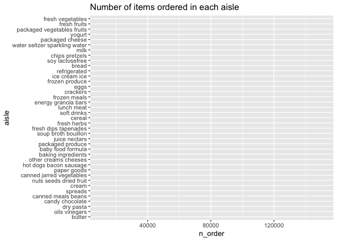

p8105_hw3_xt2288
================
2023-10-07

``` r
library(tidyverse)
```

    ## ── Attaching core tidyverse packages ──────────────────────── tidyverse 2.0.0 ──
    ## ✔ dplyr     1.1.3     ✔ readr     2.1.4
    ## ✔ forcats   1.0.0     ✔ stringr   1.5.0
    ## ✔ ggplot2   3.4.3     ✔ tibble    3.2.1
    ## ✔ lubridate 1.9.2     ✔ tidyr     1.3.0
    ## ✔ purrr     1.0.2     
    ## ── Conflicts ────────────────────────────────────────── tidyverse_conflicts() ──
    ## ✖ dplyr::filter() masks stats::filter()
    ## ✖ dplyr::lag()    masks stats::lag()
    ## ℹ Use the conflicted package (<http://conflicted.r-lib.org/>) to force all conflicts to become errors

## Problem 1

``` r
library(p8105.datasets)
data("instacart")
```

The data `instacart` has 1384617 observations and 15 variables. Some key
variables are `order_id`: order identifier, `user_id`: customer
identifier, `order_number`: the order sequence number for this user
(1=first, n=nth), `order_dow`: the day of the week on which the order
was placed, `order_hour_of_day`: the hour of the day on which the order
was placed, `product_name`: name of the product, `aisle_id`: aisle
identifier, `aisle`: the name of the aisle. Order_id 1 is made by
user_id 112108. The 4th order is made on the 4th day of the week at 10.
The product Bulgarian Yogurt is on aisle_id 120 which is yogurt.

- How many aisles are there, and which aisles are the most items ordered
  from?

``` r
instacart |>
  group_by(aisle_id) |>
  summarize(n_obs = n()) |>
  nrow()
```

    ## [1] 134

``` r
instacart |>
  group_by(aisle_id) |>
  summarize(n_obs = n()) |>
  filter(min_rank(desc(n_obs)) == 1)
```

    ## # A tibble: 1 × 2
    ##   aisle_id  n_obs
    ##      <int>  <int>
    ## 1       83 150609

There are 134 aisles, the most items are ordered from the 83 aisle.

- Make a plot that shows the number of items ordered in each aisle,
  limiting this to aisles with more than 10000 items ordered. Arrange
  aisles sensibly, and organize your plot so others can read it.

``` r
instacart |>
  group_by(aisle) |>
  summarize(n_order = n()) |>
  filter(n_order > 10000) |>
  arrange(n_order) |>
  mutate(aisle=factor(aisle, levels=aisle)) |>
  ggplot(aes(x = n_order, y = aisle)) +
  labs(
    title = "Number of items ordered in each aisle",
    xlab = "Number of items ordered",
    ylab = "Aisle"
  )
```

<!-- -->

``` r
    geom_col()
```

    ## geom_col: just = 0.5, width = NULL, na.rm = FALSE
    ## stat_identity: na.rm = FALSE
    ## position_stack

- Make a table showing the three most popular items in each of the
  aisles “baking ingredients”, “dog food care”, and “packaged vegetables
  fruits”. Include the number of times each item is ordered in your
  table.

``` r
instacart |>
  filter(aisle == "baking ingredients" |aisle ==  "dog food care" | aisle == "packaged vegetables fruits") |>
  group_by(aisle, product_name) |>
  summarize(n_order = n()) |>
  mutate(pop_ranking = min_rank(desc(n_order))) |>
  filter(pop_ranking < 2) |>
  select(-pop_ranking)
```

    ## `summarise()` has grouped output by 'aisle'. You can override using the
    ## `.groups` argument.

    ## # A tibble: 3 × 3
    ## # Groups:   aisle [3]
    ##   aisle                      product_name                                n_order
    ##   <chr>                      <chr>                                         <int>
    ## 1 baking ingredients         Light Brown Sugar                               499
    ## 2 dog food care              Snack Sticks Chicken & Rice Recipe Dog Tre…      30
    ## 3 packaged vegetables fruits Organic Baby Spinach                           9784

- Make a table showing the mean hour of the day at which Pink Lady
  Apples and Coffee Ice Cream are ordered on each day of the week;
  format this table for human readers (i.e. produce a 2 x 7 table).

``` r
instacart |>
  filter(product_name == "Pink Lady Apples" | product_name == "Coffee Ice Cream") |>
  select(product_name,  order_dow, order_hour_of_day) |>
  group_by(product_name, order_dow) |>
  summarize(
    mean_hour = mean(order_hour_of_day)) |>
  pivot_wider(
    names_from = "product_name", 
    values_from = "mean_hour")
```

    ## `summarise()` has grouped output by 'product_name'. You can override using the
    ## `.groups` argument.

    ## # A tibble: 7 × 3
    ##   order_dow `Coffee Ice Cream` `Pink Lady Apples`
    ##       <int>              <dbl>              <dbl>
    ## 1         0               13.8               13.4
    ## 2         1               14.3               11.4
    ## 3         2               15.4               11.7
    ## 4         3               15.3               14.2
    ## 5         4               15.2               11.6
    ## 6         5               12.3               12.8
    ## 7         6               13.8               11.9
