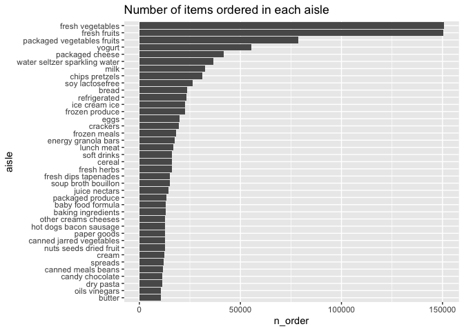
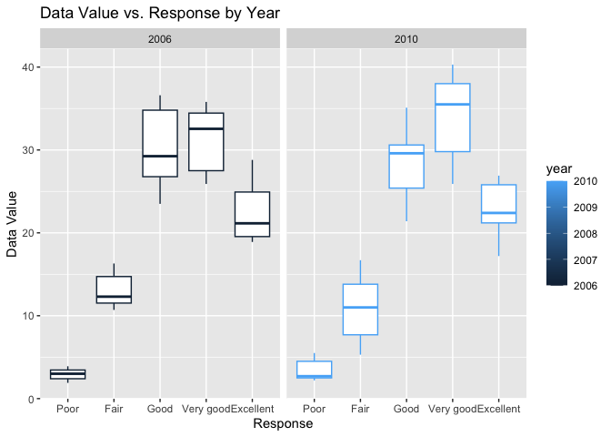
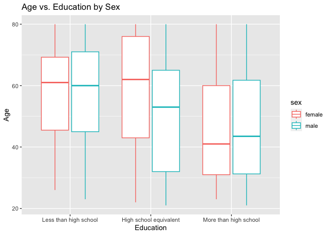
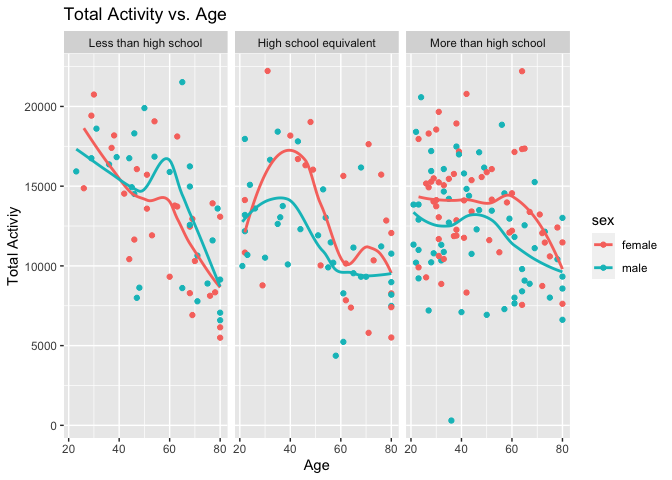

p8105_hw3_xt2288
================
2023-10-09

``` r
library(tidyverse)
```

    ## ── Attaching core tidyverse packages ──────────────────────── tidyverse 2.0.0 ──
    ## ✔ dplyr     1.1.3     ✔ readr     2.1.4
    ## ✔ forcats   1.0.0     ✔ stringr   1.5.0
    ## ✔ ggplot2   3.4.3     ✔ tibble    3.2.1
    ## ✔ lubridate 1.9.2     ✔ tidyr     1.3.0
    ## ✔ purrr     1.0.2     
    ## ── Conflicts ────────────────────────────────────────── tidyverse_conflicts() ──
    ## ✖ dplyr::filter() masks stats::filter()
    ## ✖ dplyr::lag()    masks stats::lag()
    ## ℹ Use the conflicted package (<http://conflicted.r-lib.org/>) to force all conflicts to become errors

## Problem 1

``` r
library(p8105.datasets)
data("instacart")
```

The data `instacart` has 1384617 observations and 15 variables. Some key
variables are `order_id`: order identifier, `user_id`: customer
identifier, `order_number`: the order sequence number for this user
(1=first, n=nth), `order_dow`: the day of the week on which the order
was placed, `order_hour_of_day`: the hour of the day on which the order
was placed, `product_name`: name of the product, `aisle_id`: aisle
identifier, `aisle`: the name of the aisle. Order_id 1 is made by
user_id 112108. The 4th order is made on the 4th day of the week at 10.
The product Bulgarian Yogurt is on aisle_id 120 which is yogurt.

- How many aisles are there, and which aisles are the most items ordered
  from?

``` r
instacart |>
  group_by(aisle_id) |>
  summarize(n_obs = n()) |>
  nrow()
```

    ## [1] 134

``` r
instacart |>
  group_by(aisle_id) |>
  summarize(n_obs = n()) |>
  filter(min_rank(desc(n_obs)) == 1)
```

    ## # A tibble: 1 × 2
    ##   aisle_id  n_obs
    ##      <int>  <int>
    ## 1       83 150609

There are 134 aisles, the most items are ordered from the 83 aisle.

- Make a plot that shows the number of items ordered in each aisle,
  limiting this to aisles with more than 10000 items ordered. Arrange
  aisles sensibly, and organize your plot so others can read it.

``` r
instacart |>
  group_by(aisle) |>
  summarize(n_order = n()) |>
  filter(n_order > 10000) |>
  arrange(n_order) |>
  mutate(aisle=factor(aisle, levels=aisle)) |>
  ggplot(aes(x = n_order, y = aisle)) +
  labs(
    title = "Number of items ordered in each aisle",
    xlab = "Number of items ordered",
    ylab = "Aisle"
  ) +
    geom_col()
```

<!-- -->

- Make a table showing the three most popular items in each of the
  aisles “baking ingredients”, “dog food care”, and “packaged vegetables
  fruits”. Include the number of times each item is ordered in your
  table.

``` r
instacart |>
  filter(aisle == "baking ingredients" |aisle ==  "dog food care" | aisle == "packaged vegetables fruits") |>
  group_by(aisle, product_name) |>
  summarize(n_order = n()) |>
  mutate(pop_ranking = min_rank(desc(n_order))) |>
  filter(pop_ranking < 2) |>
  select(-pop_ranking)
```

    ## `summarise()` has grouped output by 'aisle'. You can override using the
    ## `.groups` argument.

    ## # A tibble: 3 × 3
    ## # Groups:   aisle [3]
    ##   aisle                      product_name                                n_order
    ##   <chr>                      <chr>                                         <int>
    ## 1 baking ingredients         Light Brown Sugar                               499
    ## 2 dog food care              Snack Sticks Chicken & Rice Recipe Dog Tre…      30
    ## 3 packaged vegetables fruits Organic Baby Spinach                           9784

- Make a table showing the mean hour of the day at which Pink Lady
  Apples and Coffee Ice Cream are ordered on each day of the week;
  format this table for human readers (i.e. produce a 2 x 7 table).

``` r
instacart |>
  filter(product_name == "Pink Lady Apples" | product_name == "Coffee Ice Cream") |>
  select(product_name,  order_dow, order_hour_of_day) |>
  group_by(product_name, order_dow) |>
  summarize(
    mean_hour = mean(order_hour_of_day)) |>
  pivot_wider(
    names_from = "product_name", 
    values_from = "mean_hour")
```

    ## `summarise()` has grouped output by 'product_name'. You can override using the
    ## `.groups` argument.

    ## # A tibble: 7 × 3
    ##   order_dow `Coffee Ice Cream` `Pink Lady Apples`
    ##       <int>              <dbl>              <dbl>
    ## 1         0               13.8               13.4
    ## 2         1               14.3               11.4
    ## 3         2               15.4               11.7
    ## 4         3               15.3               14.2
    ## 5         4               15.2               11.6
    ## 6         5               12.3               12.8
    ## 7         6               13.8               11.9

## Problem 2

``` r
data("brfss_smart2010")
```

data cleaning

``` r
brfss_clean = brfss_smart2010 |>
  janitor::clean_names() |>
  rename(state = locationabbr, location_state = locationdesc) |>
  filter(topic == "Overall Health") |>
  mutate(
    response = factor(response, levels=c("Poor","Fair","Good", "Very good","Excellent"))
  )
```

- In 2002, which states were observed at 7 or more locations? What about
  in 2010?

``` r
brfss_2002 = 
  brfss_clean |>
  filter(year == 2002) |>
  group_by(state, response) |>
  summarize(
    n_obs = n()
  ) |>
  filter(n_obs >=7)
```

    ## `summarise()` has grouped output by 'state'. You can override using the
    ## `.groups` argument.

``` r
brfss_2010 = 
  brfss_clean |>
  filter(year == 2010) |>
  count(state, name = "n_obs") |>
  filter(n_obs >= 7*5)
```

In 2002, CT, FL, MA, NC, NJ, PA were observed at 7 or more locations. In
2010, CA, CO, FL, MA, MD, NC, NE, NJ, NY, OH, PA, SC, TX, WA were
observed at 7 or more locations.

- Construct a dataset that is limited to Excellent responses, and
  contains, year, state, and a variable that averages the data_value
  across locations within a state. Make a “spaghetti” plot of this
  average value over time within a state (that is, make a plot showing a
  line for each state across years – the geom_line geometry and group
  aesthetic will help).

``` r
brfss_clean |>
  filter(response == "Excellent") |>
  group_by(state, year) |>
  summarize(
    ave_data_value = mean(data_value) 
  ) |>
  ggplot(aes(x = year, y = ave_data_value, color = state)) +
    geom_line() +
  labs(
    title = "Average Data Value vs. Year by State",
    x = "Year",
    y = "Average Data Value"
  )
```

    ## `summarise()` has grouped output by 'state'. You can override using the
    ## `.groups` argument.

    ## Warning: Removed 3 rows containing missing values (`geom_line()`).

<!-- -->

- Make a two-panel plot showing, for the years 2006, and 2010,
  distribution of data_value for responses (“Poor” to “Excellent”) among
  locations in NY State.

``` r
brfss_clean |>
  filter(state == "NY" & (year == 2006 | year == 2010)) |>
  ggplot(aes(x = response, y = data_value, color = year)) + 
    geom_boxplot() +
    facet_grid(. ~ year)
```

<!-- -->

## Problem 3

``` r
nhanes_covar = 
  read_csv("data/nhanes_covar.csv", skip = 4) |>
  filter(age >= 21) |>
  drop_na() |>
  mutate(
    sex = case_match(
      sex,
      1 ~ "male",
      2 ~ "female"),
    education = case_match(
      education,
      1 ~ "Less than high school",
      2 ~ "High school equivalent",
      3 ~ "More than high school"),
    education = factor(education, levels = c("Less than high school", "High school equivalent", "More than high school"))
  )
```

    ## Rows: 250 Columns: 5
    ## ── Column specification ────────────────────────────────────────────────────────
    ## Delimiter: ","
    ## dbl (5): SEQN, sex, age, BMI, education
    ## 
    ## ℹ Use `spec()` to retrieve the full column specification for this data.
    ## ℹ Specify the column types or set `show_col_types = FALSE` to quiet this message.

``` r
nhanes_accel = 
  read_csv("data/nhanes_accel.csv") |>
  pivot_longer(
    min1:min1440,
    names_to = "minute",
    values_to = "MIMS_Value"
  )
```

    ## Rows: 250 Columns: 1441
    ## ── Column specification ────────────────────────────────────────────────────────
    ## Delimiter: ","
    ## dbl (1441): SEQN, min1, min2, min3, min4, min5, min6, min7, min8, min9, min1...
    ## 
    ## ℹ Use `spec()` to retrieve the full column specification for this data.
    ## ℹ Specify the column types or set `show_col_types = FALSE` to quiet this message.

``` r
nhanes_merge = left_join(nhanes_covar, nhanes_accel, by = "SEQN")
```

a table for the number of men and women in each education category.

``` r
nhanes_covar |>
  group_by(education, sex) |>
  summarize(
    n_obs = n()
  ) |>
  pivot_wider(
    names_from = sex,
    values_from = n_obs
  )
```

    ## `summarise()` has grouped output by 'education'. You can override using the
    ## `.groups` argument.

    ## # A tibble: 3 × 3
    ## # Groups:   education [3]
    ##   education              female  male
    ##   <fct>                   <int> <int>
    ## 1 Less than high school      28    27
    ## 2 High school equivalent     23    35
    ## 3 More than high school      59    56

There is no big different for the number of male and female in less than
high school and more than high school levels. 1 more female in less than
high school level, and 3 more female in more than high school level. In
the high school equivalent level, there are 12 more male than female.

a visualization of the age distributions for men and women in each
education category

``` r
nhanes_merge |>
  ggplot(aes(x = education, y = age, color = sex)) + 
  geom_boxplot() +
  labs(
    title = "Age vs. Education by Sex",
    x = "Education",
    y = "Age"
  )
```

<!-- --> In
less than high school level, the age distribution is about the same for
both sex. In high school equivalent level, female has a greater age than
male. In more than high school level, male has a slightly greater age.

Plot total activities (y-axis) against age (x-axis); the plot compare
men to women and have separate panels for each education level.

``` r
nhanes_merge |>
  group_by(SEQN) |>
  mutate(total_act = sum(MIMS_Value)) |>
  filter(minute == "min1") |>
  ggplot(aes(x = age, y = total_act, color = sex)) +
  geom_point() +
  geom_smooth(se = FALSE) +
  facet_grid(. ~ education) +
  labs(
    title = "Total Activity vs. Age",
    x = "Age",
    y = "Total Activiy"
  )
```

    ## `geom_smooth()` using method = 'loess' and formula = 'y ~ x'

<!-- -->
The total activity decreases as the age increases for both men and women
in all education levels. In less than high school education level, women
has a higher total activity before 40, and men has a higher activity
after 40. In the high school equivalent level, women has a higher total
activity. In more than high school level, female also has ahigher total
activity.

a three-panel plot that shows the 24-hour activity time courses for each
education level and sex

``` r
nhanes_merge |>
  mutate(minute = str_remove_all(minute, "min"),
         minute = as.numeric(minute)) |>
  arrange(minute) |>
  ggplot(aes(x = minute, y = MIMS_Value, color = sex)) +
  geom_point(alpha = 0.5) +
  geom_smooth(se = FALSE) +
  facet_grid( ~ education) +
  labs(
    title = "MIMS_Value vs. Minute by Sex",
    x = "Minute",
    y = "MIMS Value"
  )
```

    ## `geom_smooth()` using method = 'gam' and formula = 'y ~ s(x, bs = "cs")'

<!-- -->
Based on the plots, women and men have about the same trend of 24-hour
activity in all three education levels.
